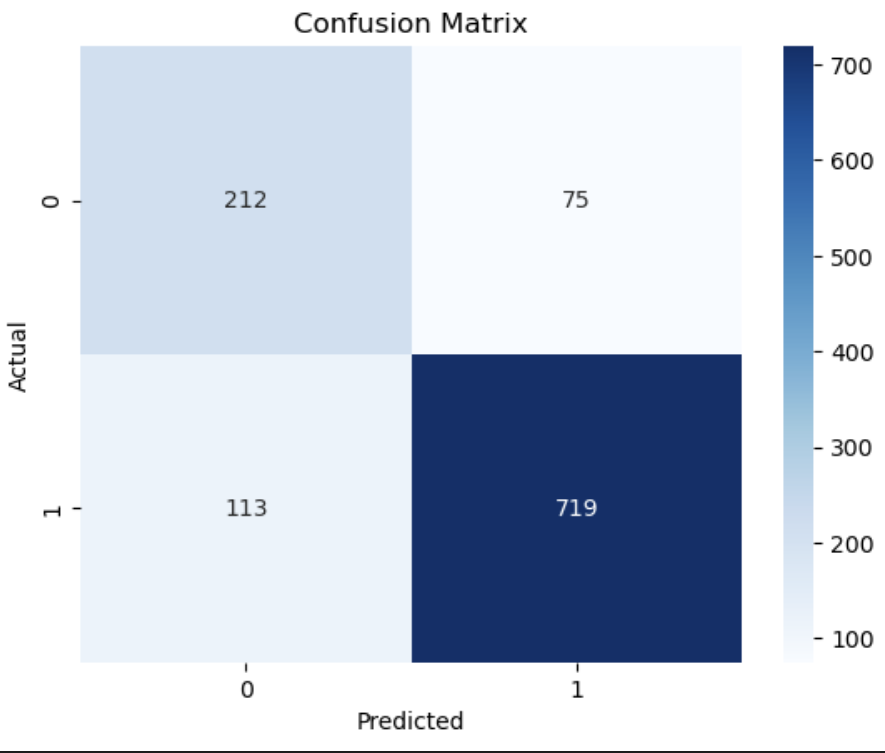

# 36: Naïve Bayes

# Table of contents

1. [Math revision](#some-revision-on-math)
2. [Bayes' theorem](#bayes-theorem)
3. [Naïve Bayes](#naïve-bayes)
4. [Naïve Bayes classifier using scikit-learn](#naive-bayes-classifier-using-scikit-learn)
5. [TODO-list for the week](#todo-list-for-the-week)

# Some revision on math

Been a while since I've done any math, so let's do some quick revision on probability. These next parts are from the material of this course [^SOURANDER]

##### Independent events

Two events are independent if the occurrence of one event does not affect the probability of the other event. For example, if you roll a die and flip a coin, the probability of getting a head on the coin is not affected by the number you roll on the die.

The probability of a student passing the course is \(0.75\) or \(P(A) = \frac{3}{4}\) and also \(P(B) = \frac{3}{4}\). If we meet two independent students, what is the probability that at least one of them passes the course?

\[
P(A \cup B) = P(A) + P(B) - P(A \cap B)
\]

\[ P(A \cap B) = P(A) \cdot P(B) \]

\[ P(A \cup B) = P(A) + P(B) - P(A) \cdot P(B) \]

```python
from fractions import Fraction

b1 = Fraction(3, 4)
b2 = Fraction(3, 4)
both = b1 * b2
either = b1 + b2 - both
print(either)
```

<details>
  <summary>The answer</summary>
  <pre><code>15/16</code></pre>
  The probability that at least one of the students passes the course is 15/16, which is approximately 0.94.
  \[ P(A \cup B) = \frac{3}{4} + \frac{3}{4} - \frac{3}{4} \cdot \frac{3}{4} \]

  \[ P(A \cup B) = \frac{15}{16} \approx 0.94 \]
</details>

</details>

##### Conditional probability

Conditional probability is the probability of an event given that another event has already occurred. The formula for conditional probability is as follows:

\[ P(A|B) = \frac{P(A \cap B)}{P(B)} \]

Where:

- $P(A|B)$ is the probability of event A given that event B has occurred.
- $P(A \cap B)$ is the probability of both events A and B occurring $P(A \cap B) = P(A) \cdot P(B)$.
- $P(B)$ is the probability of event B.

# Bayes' theorem

Bayes' Theorem provides a way to revise existing predictions, update probabilities given new or additional evidence.
The formula is as follows:

$$P(A|B) = \frac{P(B|A) \cdot P(A)}{P(B)}$$

Where:

- $P(A|B)$ is the probability of event A given that event B has occurred.
- $P(B|A)$ is the probability of event B given that event A has occurred.
- $P(A)$ is the probability of event A.
- $P(B)$ is the probability of event B.

This can be also written as:

$$posterior = \frac{likelihood \cdot prior}{evidence}$$

# Naïve Bayes

The word Naive comes from the assumption this algorithm makes, that all features are conditionally independent of each other. This means that the presence of a particular feature in a class is unrelated to the presence of any other feature [^MLDUMMIES]. It also assumes that the effect of each feature to the outcome is the same, which also makes the algorith unable to learn the relationship between the features.

##### WHY NAIVE BAYES?

As explained in [^TDS], theoretically finding the propability of $P(X|Y)$ is not hard but in most cases in machine learning we're dealing with a large set of features. This complicates the calculation (and makes it time consuming computationally) of the probability since the number of parameters grows exponentially with the number of features added if the features $x_i$ are binary.

Naive Bayes comes to the rescue and simplifies this by assuming that the features are independent of each other.

##### EXAMPLE

Example of the spam filter from youtube video [^video] also found from the course materials for elements of AI [^EOAI]. The filter uses the words in the email to determine if it is spam or not. The training data would consist of words from emails that are classified as spam and not spam.

For each word we would calculate **likelihood** by the formulas:

$$P(word|spam) = \frac{count(word, spam)}{count(spam)}$$

$$P(word|not spam) = \frac{count(word, not spam)}{count(not spam)}$$

Then we would calculate the **prior** probabilities for spam and not spam emails:

$$P(spam) = \frac{count(spam)}{count(allemails)}$$

$$P(not spam) = \frac{count(not spam)}{count(allemails)}$$

Then we would calculate the **evidence**:

$$P(word) = \frac{count(word)}{count(allemails)}$$

Finally we would calculate the **posterior** where we can remove the denominator since it's the same for both classes[^SOURANDER]:

$$P(spam|word) = P(word|spam) \cdot P(spam)$$

# Allure suite 03 Naïve Bayes

The required parts to be implemented in the Allure suite 03 were the following:

1. lowercase the wrods and remove non-alphanumeric characters

    ``` python
    word = "".join([character for character in word.lower() if character.isalnum()])
    ```

    Here the isalnum() method checks if all the characters in the word are alphanumeric. If they are, the method returns True. The join() method joins all the characters in the word into a single string and the lower() method converts the string into lowercase.
2. calculate the prediction for the class 0 and 1 using the formula:

    Calculate the prediction for the class 0 and 1 using the formula:

    $P(class) \cdot \prod_{word \in evidence} P(word|class)$

    ``` python
    self.priors[1] * prod(self.word_likelihoods[word][1] for word in evidence.split() if word in self.word_likelihoods)
    ```

# Naive Bayes classifier using scikit-learn

Data set from paper "Automated Hate Speech Detection and the Problem of Offensive Language" by Davidson et al. (2017) [^Davidson2017].

In my work I used the same methods to preprocess the data as in the paper with some differences. I first removed the class 1: offensive language and left only the classes 0: hate speech and 2: neither. Then I used the same filtering they had done in their notebook:

```python
stopwords=stopwords = nltk.corpus.stopwords.words("english")

other_exclusions = ["#ff", "ff", "rt"]
stopwords.extend(other_exclusions)

stemmer = PorterStemmer()


def preprocess(text_string):
    """
    Accepts a text string and replaces:
    1) urls with URLHERE
    2) lots of whitespace with one instance
    3) mentions with MENTIONHERE

    This allows us to get standardized counts of urls and mentions
    Without caring about specific people mentioned
    """
    space_pattern = '\s+'
    giant_url_regex = ('http[s]?://(?:[a-zA-Z]|[0-9]|[$-_@.&+]|'
        '[!*\(\),]|(?:%[0-9a-fA-F][0-9a-fA-F]))+')
    mention_regex = '@[\w\-]+'
    parsed_text = re.sub(space_pattern, ' ', text_string)
    parsed_text = re.sub(giant_url_regex, '', parsed_text)
    parsed_text = re.sub(mention_regex, '', parsed_text)
    return parsed_text

def tokenize(tweet):
    """Removes punctuation & excess whitespace, sets to lowercase,
    and stems tweets. Returns a list of stemmed tokens."""
    tweet = " ".join(re.split("[^a-zA-Z]*", tweet.lower())).strip()
    tokens = [stemmer.stem(t) for t in tweet.split()]
    return tokens

vectorizer = TfidfVectorizer(
    tokenizer=tokenize,
    preprocessor=preprocess,
    ngram_range=(1, 3),
    stop_words=stopwords,
    use_idf=True,
    smooth_idf=False,
    norm=None,
    decode_error='replace',
    max_features=10000,
    min_df=5,
    max_df=0.75
    )
```

In this code they remove urls, mentions and whitespace from the tweets with the function `preprocess`. Then they tokenize the tweets with the function `tokenize` and stem the words with the `PorterStemmer`. They also remove stopwords and set the ngram range to 1-3. The `TfidfVectorizer` is used to convert the tweets into a matrix of TF-IDF features. I then split the data into training and testing sets with `test_size=0.2` which means that 20% of the data is used for testing and 80% for training. To make results reproducible I set the `random state`. I then trained the Naive Bayes classifier with the training data and tested it with the testing data. The accuracy of the classifier was 0.83 (not that it matters).

Here's also a a confusion matrix


I have used these before but to refresh my memory I will explain them here (all from [^Grus]):

- **Tokenization** in the context of language processing this means splitting the text into words or phrases and even to individual letters. In the code above code above the tweets are tokenized into words by removing punctuation and whitespace and setting the text to lowercase.
- **Stemming** means reducing the words to their root form. E.g. "running" -> "run".
- **Stopwords** are common words that are often removed from text because they are not important for the meaning of the text.
- **N-grams** are sequences of words or characters that appear together in a text.

## TODO-list for the week

- [x] Watch the videos for Naïve Bayes.
- [x] Allure 02
- [x] Train a Naïve Bayes classifier.
- [x] Write the learning diary entry for the week.
- [x] Polish the learning diary entry for the week.

One sentence summary: A Naive Bayes is a probabilistic classification algorithm based on Bayes' Theorem, which assumes that the features are independent of each other given the class label, despite this assumption often being unrealistic in practice.

[^SOURANDER]:[Sourander J. (2024) Koneoppimisen Perusteet kurssin materiaali -- Bayes: Intuitio](https://sourander.github.io/ml-perusteet/algoritmit/bayes/intuitio/)
[^MLDUMMIES]: [Mueller, J. P., & Massaron, L. (2016). Machine learning for dummies](https://www.wiley.com/en-mx/Machine+Learning+For+Dummies-p-9781119245513)
[^TDS]: [Zhang Z., (2019), Medium: Naive Bayes Explained](https://towardsdatascience.com/naive-bayes-explained-9d2b96f4a9c0)
[^video]: [Starmer J., (2020), Statquest YouTube video: Naive Bayes, Clearly Explained!!!](https://www.youtube.com/watch?v=O2L2Uv9pdDA)
[^EOAI]: [University of Helsinki: Course Elements of AI](https://course.elementsofai.com/3/3) accessed: 2024-09
[^Davidson2017]: [Davidson, T., Warmsley, D., Macy, M., & Weber, I. (2017). Automated Hate Speech Detection and the Problem of Offensive Language. *Proceedings of the International AAAI Conference on Web and Social Media*, 11(1), 512–515.](https://doi.org/10.1609/icwsm.v11i1.14955)
[^Grus]: [Grus, J. (2015). Data Science from Scratch. O'Reilly Media, Inc.](https://www.oreilly.com/library/view/data-science-from/9781491901410/?_gl=1*qjefjw*_ga*MTY5MzQwNzk2NS4xNzI4ODM2NTc1*_ga_092EL089CH*MTcyOTY3MjUwNC4yLjEuMTcyOTY3MjU1OS41LjAuMA)
