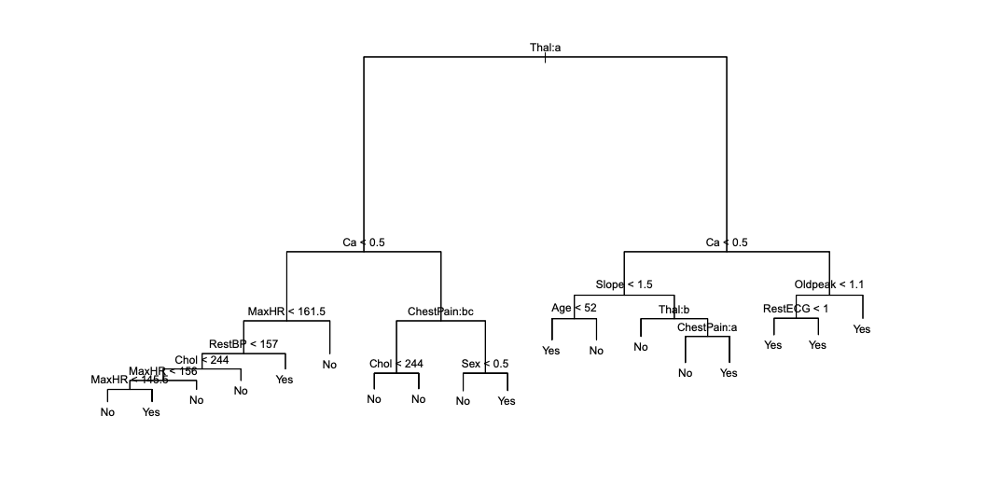
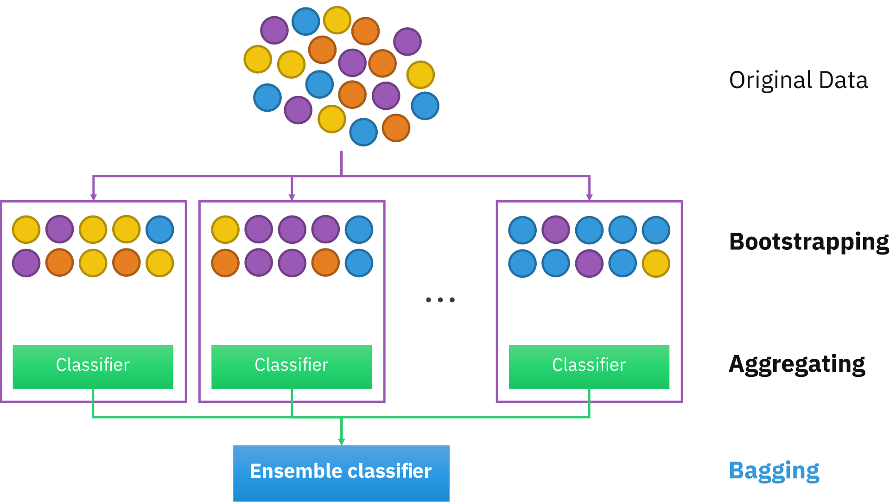
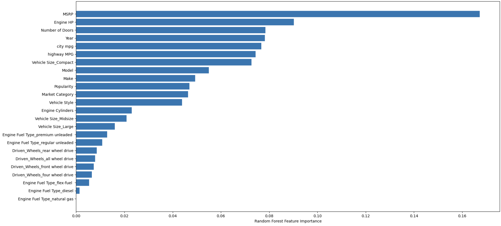
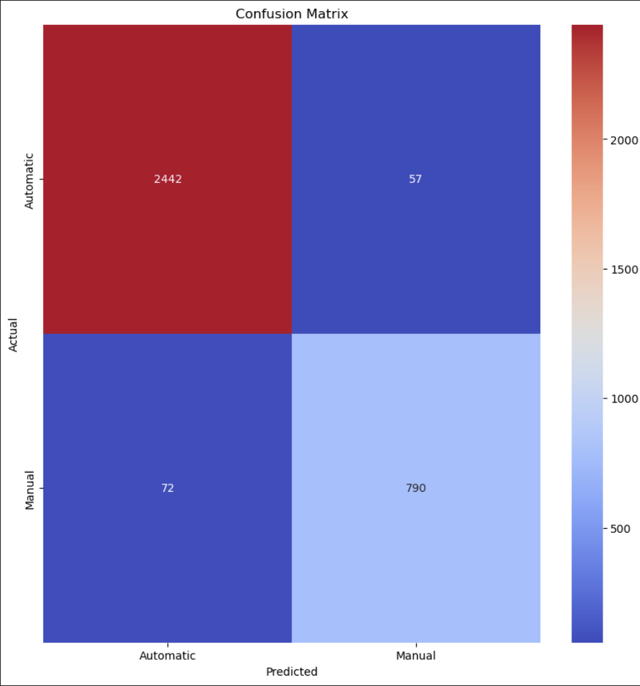

# 37: Decision trees and Random Forests

# Table of contents

1. [Decision Trees](#decision-trees)
2. [Information content and Entropy](#information-content-and-entropy)
3. [Information Gain](#information-gain)
4. [Random Forest](#random-forest)
5. [Allure suite 03 Decision tree and 04 Random Forest](#allure-suite-03-decision-tree-and-04-random-forest)
6. [Random forest classifier using scikit-learn](#random-forest-classifier-using-scikit-learn)
7. [TODO-list for the week](#todo-list-for-the-week)

# Decision Trees

Can be seen as a tree like structure that consists of a root node, internal nodes, and leaf nodes, where the root node represents the entire dataset, and the internal nodes represent the features of the dataset. The whole tree portrays the decision made (decision path) to get to the final outcome [^Grus].


Example image of a classification decision tree from [^ISLP].
The decision tree is constructed by recursively partitioning the data into subsets. At each step, we aim to assign observations to the most frequent class in the subset, especially if the feature is categorical or binary. Partitioning is done by selecting the feature that best splits the data, maximizing the alignment with the target variable.

The example images decision tree was constructed with data set that contained 303 patients who presented with chest pain and the binary outcome was HD meaning heart disease. There is 13 features in the data set including sex, age and MaxHR. The tree was built to predict the outcome of heart disease based on the features which are both qualitative and quantitative. For example, the top internal node corresponds to splitting Thal which is Thallium stress test. This can take values normal or fixed or reversible defect.

# Information content and Entropy

To build a decision tree, we need to decide which feature to split on at each node. This decision is based on the information content of the features, which is measured by entropy. Entropy quantifies the uncertainty of a variable; an entropy of 0 means no uncertainty, while an entropy of 1 represents maximum uncertainty[^Grus]. The specific form of entropy used in decision trees is Shannon entropy, as defined and proof by Shannon[^SHANNON]:
$$
H(X) = - \sum_{i} p(x_i) \log_b p(x_i)
\label{entropy_eq}
$$

Where $H(X)$ is the entropy of the variable $X$, which is the data (here could be the example heart disease data sets feature age) and $p(x_i)$ is the probability of the variable $X$ taking the value $x_i$. In the example $p(50)$ so the probability of the patients age being 50. When constructing the decision tree, the goal is to minimize the entropy at each split, creating more "pure" subsets of data where the classification is clearer and more distinct.

# Information Gain

"Information gain is a measure used to determine which feature should be used to split the data at each internal node of the decision tree " [^MEDIUM] <br>

We aim to maximize information gain when splitting the data, which effectively reduces the uncertainty $H(X)$ of the target variable, leading to a significant decrease in entropy.

The information gain is calculated by the following formula:

$$IG(X, a) = H(X) - H(X|a)$$

Where $IG(X, a)$ is the information gain of the variable $X$ when splitting on the feature $a$, $H(X)$ is the entropy of the variable $X$ which is taken from the previous node, and $H(X|a)$ is the conditional entropy of the variable $X$ given the feature $a$. The feature with the highest information gain is selected as the splitting feature. This is where the saying: "A reduction of entropy is often called an information gain" [^Geron].

# Random Forest

As Grus describes random forests in his book[^Grus]:
Decision trees tend to overfit their training data, but random forests can help mitigate this issue. Random forests build multiple decision trees and aggregate their classifications through a voting system. The process introduces randomness in two ways:

1. Bootstrapping: Each tree is trained on a different subset of the training data, created by sampling with replacement (bootstrap sampling). This ensures that each tree is unique.
    Bagging aka Bootstrap aggregating

    

    How bagging works[^bagging]

2. Random attribute selection: Instead of evaluating all attributes when deciding on a split, a random subset of attributes is considered, and the best from that subset is chosen.

# Allure suite 03 Decision tree and 04 Random Forest

With the suite 03 for the decision tree there was two tasks:

First there was a task to implement the entropy calculation in the `entropy` function.
The function calculates the entropy from a list of probabilities using the function \(\ref{entropy_eq}\). The function is implemented as follows:

```python
def entropy(X) -> float:
    # IMPLEMENT: Entropy calculation
    H_val = - sum([p * log2(p) for p in X if p > 0])
    return H_val
```

Don't know if it's necessary/mandatory to check if the probability is greater than 0, but it's done to here avoid the log2(0) which is undefined.

The second task was to implement the class probabilities in the `class_probabilities` function. The function calculates the probabilities of the classes in a column of data. The function is implemented as follows:

```python
def class_probabilities(column_values) -> list[float]:
    # IMPLEMENT: Class probabilities
    #  Returning e.g. [0.5, 0.5] for a binary column with equal number of 0s and 1s
    #possible_classes = set(column_values)
    possible_classes = [0, 1]
    n = len(column_values)
    if n == 0:
        return [0.0, 0.0]
    return [column_values.count(c) / n for c in possible_classes]
```

Here it is assumed that the classes are binary, so the possible classes are set to 0 and 1.

The suite 04 Random forest had to implement the bagging functions with and without replacement which I did like this :

```python
data = random.sample(data, n) # without replacement
data = random.choices(data, k=len(data)) # with replacement, choosing the same data multiple times
```

# Random forest classifier using scikit-learn

The task was to train a random forest classifer (and/or a decision tree) using car data from kaggle to predict if the car was automatic or not.
I did quite long preprocessing and EDA  to get the data in a good shape. I removed the rows with values in the list (AUTOMATED_MANUAL, DIRECT_DRIVE, UNKNOWN), filled the missing values with mean for the numerical columns and mode for the categorical columns. Also converted the categorical columns to numerical using ```pd.get_dummies()```  using one-hot encoding and ```LabelEncoder```. This was decided with If there is less than 10 classes I  used one hot encoding, otherwise label encoding to avoid the curse of dimensionality. Split the data to train and test sets using 0.3 test size and trained the model with the default parameters.

```python
Random forest classifier 0.9616185659030051 and Decision Tree classifier 0.9526926509967272
```

**Feature importance for the Random Forest classifier:**


From this the top 3 are MSRP which is the manufacturer's suggested retail price, Engine HP and Number of doors that mostly influence the outcome of the target variable. I don't know about cars if this is logical or not so I just have to trust the model.

**Confusion matrix for the Random Forest classifier:**

Since it has 72 values precited as Automatic that were actually Manual and 52 values predicted as Manual that were actually Automatic, the model is not perfect but still quite good.

# TODO-list for the week

- [x] Decision Tree video
- [x] Random Forest video
- [x] Reading
- [x] Write the learning diary entry for the week
- [x] Allure suite 03 Decision tree
- [x] Allure suite 04 RF
- [x] Train the Random Forest model
- [x] Polishing

One sentence summary: Decision trees and random forests are used in classification tasks to predict the outcome of a target variable by recursively partitioning the data into subsets and training multiple trees on different subsets of the data.

[^Grus]: [Grus, J. (2015). Data Science from Scratch. O'Reilly Media, Inc.](https://www.oreilly.com/library/view/data-science-from/9781491901410/?_gl=1*qjefjw*_ga*MTY5MzQwNzk2NS4xNzI4ODM2NTc1*_ga_092EL089CH*MTcyOTY3MjUwNC4yLjEuMTcyOTY3MjU1OS41LjAuMA)
[^ISLP]: [James, G., Witten, D., Hastie, T., Tibshirani, R., & Taylor, J. (2023). Introduction to statistical learning with Python. In Springer Texts in Statistics. Springer International Publishing.](https://doi.org/10.1007/978-3-031-38747-0_1)
[^SHANNON]: [Soch, J., et al. (2024). The Book of Statistical Proofs: Entropy of the categorical distribution (Version 2023). Zenodo. https://doi.org/10.5281/ZENODO.4305949](https://statproofbook.github.io/P/cat-ent.html)
[^MEDIUM]: [Pramod, O. (2023). Medium: Decision Trees Part 2: Information Gain](https://medium.com/@ompramod9921/decision-trees-6a3c05e9cb82)
[^Geron]: Géron A. (2019). Hands-On Machine Learning with Scikit-Learn, Keras, and TensorFlow : Concepts, Tools, and Techniques to Build Intelligent Systems: Vol. Second edition. O’Reilly Media.
[^bagging]: [Sirakorn. (2020). Ensemble Bagging Illustration. Wikimedia Commons.](https://en.wikipedia.org/wiki/File:Ensemble_Bagging.svg.) Licensed under CC BY-SA 4.0.
