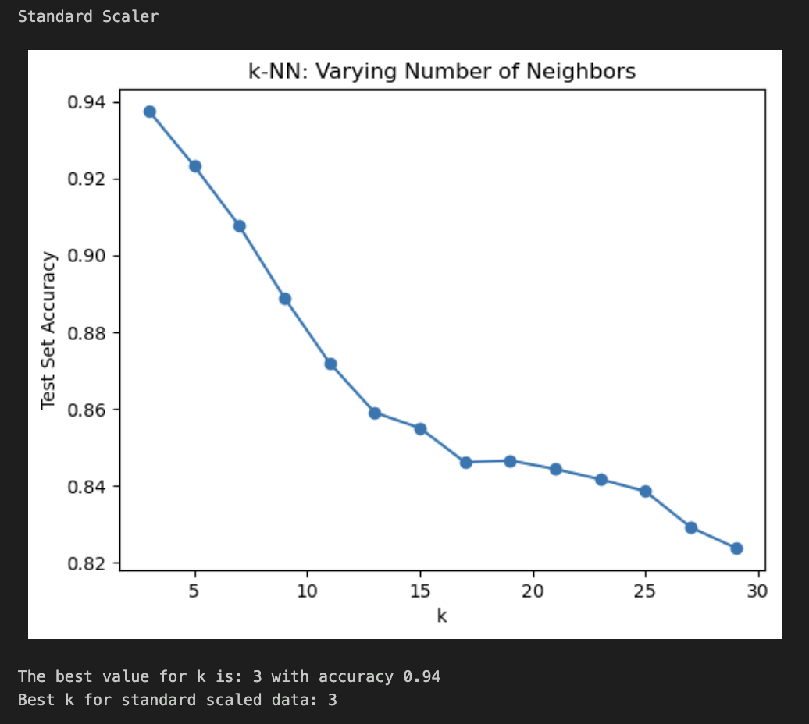
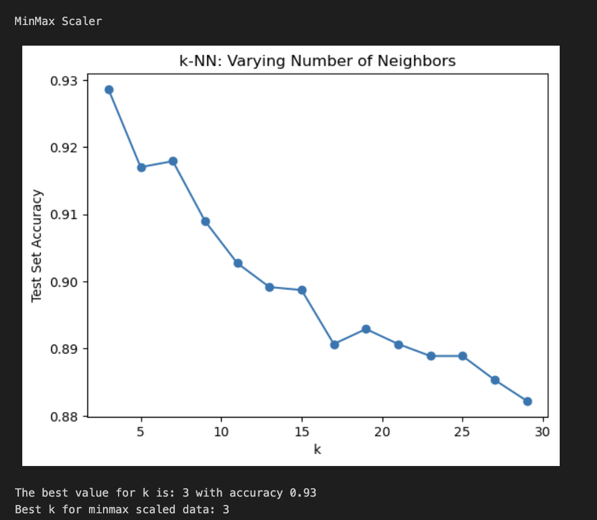

# 38: K-nearest neighbors

# Table of contents

1. [K-nearest neighbors](#k-nearest-neighbors)
2. [Allure suite 05 K-NN](#allure-suite-06-k-nn)
3. [K- nearest neighbors classifier using scikit-learn](#k--nearest-neighbors-classifier-using-scikit-learn)
4. [TODO-list for the week](#todo-list-for-the-week)

# K-nearest neighbors

K-nearest neighbors (K-NN) uses distance claculation between data points to classify or predict data [^SOURANDER]. The algorithm is simple and intuitive, as it classifies the data points based on the majority class of the k-nearest neighbors.
The algorithm has three in classifiying the data points:

1. Choose the number of neighbors (k)
2. When encountering a new data point, calculate the distance to all other data points using a distance metric (e.g., Euclidean distance)
    Formula for Euclidean distance:

    $$
    D(p, q) = \sqrt{\sum_{i=1}^{n}(p_i - q_i)^2}
    $$
    where \(p\) and \(q\) are the data points and \(n\) is the number of dimensions.

3. Assign the new data point to the majority class of the k-nearest neighbors

!!! note
    **Curse of dimensionality**
    "is a term introduced by Richard Bellman to describe the problem caused by the exponential increase in volume associated with adding extra dimensions to Euclidean space " [^Keogh]
    Adding dimensions and not adding data points will lead to very sparse data.
    K-NN is sensitive to the curse of dimensionality, as the distance between the data points increases with the number of dimensions. This can lead to the algorithm classifying the data points incorrectly.

This is is also presented in a probabilistic ways in the book Introduction to statistical learning[^ISLP]:
$$
\text{Pr}(Y = j \mid X = x_0) = \frac{1}{K} \sum_{i \in N_0} I(y_i = j)
$$

where \(N_0\) is the set of \(K\) points closest to \(x_0\). $I(y_i = j)$ is an indicator function that equals 1 if \(y_i = j\) and 0 otherwise, essentially counting the number of points in \(N_0\) that belong to class \(j\). The term, $\frac{1}{K}$, is used to normalize the probabilities so that they sum to 1.

# Allure suite 05 K-NN

1. Euclidian distance

    ```python
        def euclidean_distance(p, q) -> float:
            # IMPLEMENT This should return the Euclidean distance between two points.
            squares = [(p-q) ** 2 for p, q in zip(p, q)]
            return sum(squares) ** 0.5
    ```

2. majority_vote

    This function calculates the majority vote of the k-nearest neighbors (data points) by going through the neighbors and adding one vote for the label. The label with the most votes is returned.

    ```python
        def majority_vote(neighbors:list[Neighbor]):
            votes = defaultdict(int)
            # IMPLEMENT
            for neigbour in neighbors:
                votes[neigbour.label] += 1 # add one vote for the label
            return max(votes, key=votes.get)
    ```

# K- nearest neighbors classifier using scikit-learn

I used the same preprocessing as before to fill up the missing values. Used standard scaler[^SCIKITSTANDARD] from scikit learn which removes the mean and scaling to unit variance. Also tried minmax scaler[^SCIKITMINMAX] to scale the data which scales the data to a given range. After scaling used the K-NN to classify the target variable `Transmission Type`
Used also the split to test and train the data with 0.3 test size. The accuracy of the model was calculated using the accuracy_score from scikit-learn.
I set the K value ta start from 3 and to go to 30 with uneven steps to avoid the even number of neighbors which could lead to a tie in the majority vote.

Using the standard scaler the accuracy with k = 3 was 0.94 using the standard scaler and 0.93 using the minmax scaler. The accuracy was the same for both scalers. The accuracy decreased when the k value was incereased. When compared to the Random Forest classifier with accuracy of (0.96), the K-NN classifier had a lower accuracy. The lower accuracy of KNN could be attributed to the curse of dimensionality, as the dataset has many features, causing the distances between points to become less meaningful in higher dimensions.

Here's some graphs to show how th accuracy of the model decreases with the increase of the k value:



The models accuracy decreases with the increase of the k value, this could be due to the curse of dimensionality. Or the model could be overfitting the data with the lower k values.

# TODO-list for the week

- [x] K-NN video
- [x] K-NN reading
- [x] K-NN notebook
- [x] Write the learning diary entry for the week
- [x] Polish the learning diary entry for the week
- [x] Allure suite 05 K-NN

One sentence summary: K-nearest neighbors is a simple algorithm that classifies data points based on the majority class of the k-nearest neighbors, but is sensitive to the curse of dimensionality.

[^SOURANDER]:[Sourander J. (2024) Koneoppimisen Perusteet kurssin materiaali -- K-nearest](https://sourander.github.io/ml-perusteet/algoritmit/distance/knn/)
[^Keogh]: Keogh, E., & Mueen, A. (2011). Curse of Dimensionality. In Encyclopedia of Machine Learning (pp. 257–258). Springer US. <https://doi.org/10.1007/978-0-387-30164-8_192>
[^ISLP]: [James, G., Witten, D., Hastie, T., Tibshirani, R., & Taylor, J. (2023). Introduction to statistical learning with Python. In Springer Texts in Statistics. Springer International Publishing.](https://doi.org/10.1007/978-3-031-38747-0_1)
[^SCIKITSTANDARD]: [Scikit-learn: Standard scaler](https://scikit-learn.org/dev/modules/generated/sklearn.preprocessing.StandardScaler.html)
[^SCIKITMINMAX]: [Scikit-learn MinMax scaler](https://scikit-learn.org/dev/modules/generated/sklearn.preprocessing.MinMaxScaler.html#sklearn.preprocessing.MinMaxScaler)
