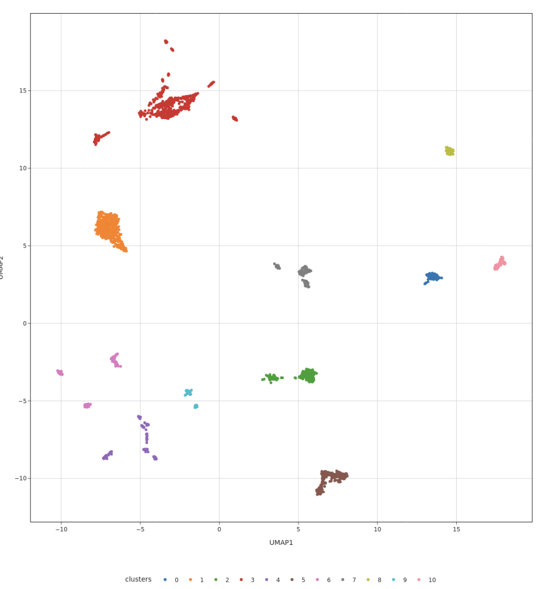
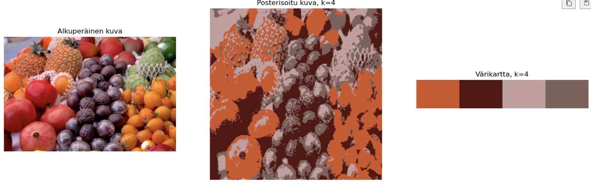

# 39: K-means

# Table of contents

1. [K-means](#k-means)
2. [Other clustering algorithms from Geron (2019)](#other-clustering-algorithms-from-geron-2019)
3. [Allure suite 06 K-means](#allure-suite-06-k-means)
4. [K-means clustering using scikit-learn](#k-means-clustering-using-scikit-learn)
5. [TODO-list for the week](#todo-list-for-the-week)

# K-means

K-means is a unsupervised clustering algorithm first proposed by Stuart Lloyd in 1957 as a technique for pulse-code modulation at Bell Labs the algorithm wasn't published until 1982 but 1965, Edward W. Forgy published almost the same algorithm, which is why it is most often referred as Lloyd-Forgy [^Geron][^Lloyd].

K-means is used to group similar data points by iteratively assigning each data point to the nearest cluster (k), based on the distance between points. The number of clusters is chosen in advance. The algorithm calculates the mean of the data points in each cluster and updates the cluster's center accordingly. This process continues until the cluster centers stabilize, meaning they no longer change, or another termination criterion is met.

The algorithm has four steps [^SOURANDER]:

1. Choose the number of clusters (k)
2. Initialize the cluster centers (x,y) for the k clusters by random
3. Assign each data point to the nearest cluster
4. Update the cluster centers by calculating the mean of the data points in each cluster

I've previously used k-means in my master thesis to see how similar taxonomic classes (bacterial species) cluster using methylation signatures which have been reduced to two dimensions using UMAP. Also tried DBSCAN but since it's density based it didn't work as well as K-means.
This was done to see how well the different species cluster together and compare methylation between clusters and between species.

Here's an example figure from my thesis:


# Other clustering algorithms from Geron (2019) [^Geron]

- Density-Based Spatial Clustering of Applications with Noise (DBSCAN)
  **DBSCAN** (Density-Based Spatial Clustering of Applications with Noise) is a density-based clustering algorithm that identifies clusters as regions with a high density of points. It uses two key parameters: **epsilon (ε)**, which defines the radius around each point, and **MinPts**, which is the minimum number of points required to form a cluster. Points are categorized as **core points** (those with enough neighboring points), **border points** (within ε of a core but with fewer neighbors), or **noise points** (those that do not belong to any cluster). DBSCAN can discover clusters of arbitrary shapes and naturally handles outliers as noise, making it effective for datasets with complex structures.

- Agglomerative clustering
    is a **hierarchical clustering** technique that builds clusters from the bottom up. It starts by treating each data point as its own cluster and iteratively merges the closest clusters until a stopping criterion is reached, such as the desired number of clusters. This process creates a **dendrogram**, which is a tree-like diagram that helps visualize how clusters are formed. Agglomerative clustering is particularly useful when the underlying cluster structure is hierarchical.

# Allure suite 06 K-means

The suite 06 for K-means had one task to implement the data_to_points function which converts the data to a list of Point objects. The function is implemented as follows:

```python
    def data_to_points(data: list[tuple[float]]) -> list[Point]:
        # IMPLEMENT
        return [Point(coordinates= data_point) for data_point in data]
```

Had some trouble with the Point object, but after some debugging, I got it to work.

# K-means clustering using scikit-learn

Here the task was to create a posterized image using the K-means clustering algorithm.  I had very limited time to do this task, so I used the code from the course material and made some small changes to it. The code is as follows:

```python
cluster_centers = kmeans.cluster_centers_.astype(int)

labels = kmeans.labels_ 
posterized_img = cluster_centers[labels].reshape(img_resized.shape)

fig, ax = plt.subplots(1, 3, figsize=(18, 6))

ax[0].imshow(img_rgb)
ax[0].set_title("Alkuperäinen kuva")
ax[0].axis('off')

ax[1].imshow(posterized_img.astype(np.uint8))
ax[1].set_title(f"Posterisoitu kuva, k={k}")
ax[1].axis('off')

color_strip = np.zeros((50, 300, 3), dtype=int)
width_per_color = 300 // k

for i, color in enumerate(cluster_centers):
    color_strip[:, i*width_per_color:(i+1)*width_per_color, :] = color

ax[2].imshow(color_strip)
ax[2].set_title(f"Värikartta, k={k}")
ax[2].axis('off')

plt.show()
```

The code reads an image, resizes it, and then uses the K-means algorithm to cluster the colors in the image. The cluster centers are then used to create a posterized image. The code also creates a color strip to show the colors used in the posterized image.
Results are shown below:


I did dig into how this could have been done better
By using kernel smoothing [code I found from github](../notes/note2.md)
This code applies kernel-based smoothing (average, min, or max pooling) to an image before the KNN to reduce the noise in the image.

# TODO-list for the week

- [x] K-means video
- [x] K-means reading
- [x] K-means notebook
- [x] Allure suite 06 K-means
- [x] Notebook to train kmeans
- [x] Write the learning diary entry for the week
- [x] Polish the learning diary entry for the week

[^Geron]: Géron A. (2019). Hands-On Machine Learning with Scikit-Learn, Keras, and TensorFlow : Concepts, Tools, and Techniques to Build Intelligent Systems: Vol. Second edition. O’Reilly Media.
[^Lloyd]: Lloyd S. (1982) “Least Squares Quantization in PCM,” IEEE Transactions on Information Theory 28, no. 2 (129–137).
[^SOURANDER]:[Sourander J. (2024). Koneoppimisen Perusteet kurssin materiaali -- K-Means](https://sourander.github.io/ml-perusteet/algoritmit/distance/kMeans/)
