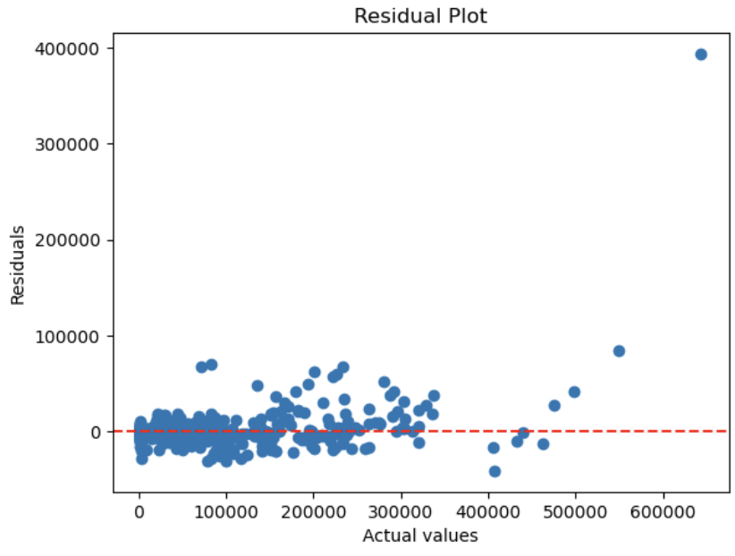
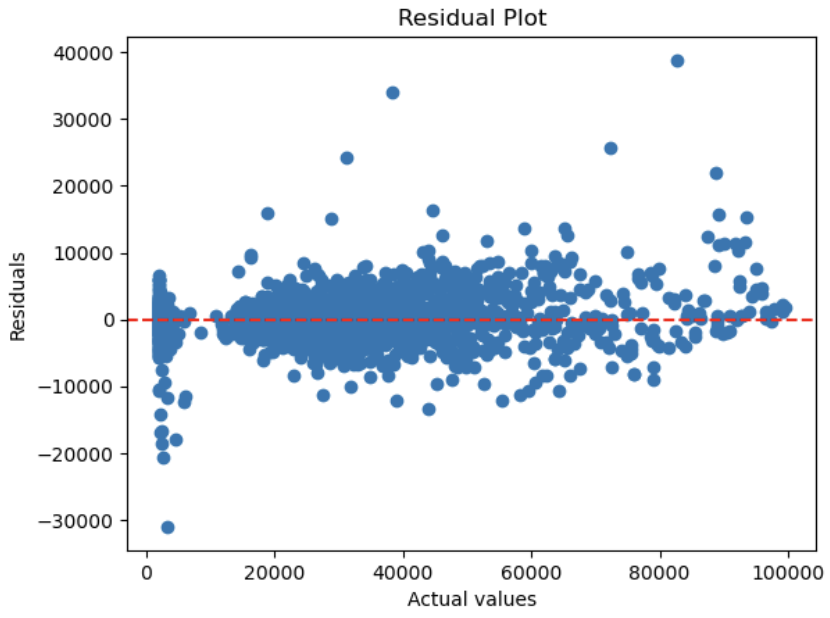

# 40: Linear Regression

# Table of contents

1. [Linear Regression](#linear-regression)
2. [Hill climbing](#hill-climbing)
3. [Allure suite 07: Hill climbing](#allure-suite-07-hill-climbing)
3. [Using Linear regression with scikit-learn](#using-linear-regression-with-scikit-learn)

# Liner Regression

Linear regression is a approach to modeling the relationship between a dependent variable (one or more) and one or more independent variables. The relationship is modeled as a linear equation, which is [^ISLP]:

$$
y = b_0 + b_1x_1 + b_2x_2 + ... + b_nx_n
$$

Where:

- $y$ is the dependent variable we are trying to predict
- $b_0$ is the intercept of the line
- $b_1$ is the coefficient for $x_1$
- $b_n$ is the coefficient for $x_n$

## Least Squares Method using Mean Squared Error

The coefficients in linear regression models are often estimated using the least squares method. This method minimizes the Mean Squared Error (MSE), which quantifies the average of the squared differences between the observed values and the predicted values. The formula for the MSE is:

$$
MSE = \frac{1}{n} \sum_{i=1}^{n} (y_{\text{observed}} - y_{\text{predicted}})^2
$$

In a more compact, vectorized form, MSE is represented as:

$$
MSE(\mathbf{X}, h_{\theta}) = \frac{1}{m} \sum_{i=1}^{m} \left( \theta^T \cdot \mathbf{x}^{(i)} - y^{(i)} \right)^2
$$

Where:

- $m$ is the number of instances in the dataset.
- $\mathbf{x}^{(i)}$ represents the vector of all the feature values (excluding the label) of the $i^{th}$ instance in the dataset.
- $y^{(i)}$ is the actual label of the $i^{th}$ instance.
- $\theta$ is the model's parameter vector, which includes the bias term $b$ and the feature weights $w_1, w_2, ..., w_n$.

## Residual Sum of Squares

The least squares method not only minimizes MSE but is also pivotal in minimizing the Residual Sum of Squares (RSS) when estimating linear regression coefficients. The RSS is essential in determining the efficacy of a regression model by measuring the sum of the squared residuals, where each residual represents the difference between an observed value and a predicted value.

According to the Introduction to Statistical Learning[^ISLP], the least squres regression coefficients \( \hat{\beta}_0 \) and \( \hat{\beta}_1 \), which minimize the RSS, are calculated as follows:

$$
\hat{\beta}_1 = \frac{\sum_{i=1}^n (x_i - \bar{x})(y_i - \bar{y})}{\sum_{i=1}^n (x_i - \bar{x})^2}
$$

$$
\hat{\beta}_0 = \bar{y} - \hat{\beta}_1 \bar{x}
$$

Where:

- \( \bar{y} \) is the mean of the observed values, calculated as:

  $$
  \bar{y} = \frac{1}{n} \sum_{i=1}^{n} y_i
  $$

- \( \bar{x} \) is the mean of the input feature values, calculated as:

  $$
  \bar{x} = \frac{1}{n} \sum_{i=1}^{n} x_i
  $$

The  regression coefficients \( \hat{\beta}_0 \) and \( \hat{\beta}_1 \) create the least squares line.
$$ Y = \hat{\beta}_0 + \hat{\beta}_1X $$

## Minimizing the least squares function

The least squares function can be minimized using the normal equation, which provides the optimal values for the model parameters. The normal equation is given by[^SOURANDER2]:

$$
\hat{\beta} = (\mathbf{X}^T \cdot \mathbf{X})^{-1} \cdot \mathbf{X}^T \cdot \mathbf{y}
$$
One of the limitations listed in [^SOURANDER2]
If the $(\mathbf{X}^T \cdot \mathbf{X})$ is not invertible, the normal equation cannot be used. These kind of situations can occur when there are more features than instances in the dataset or when some features are redundant or linearly dependent (= multicollinearity).

# Hill climbing

summary from [^Sourander]:
Hill Climbing is a simple optimization algorithm used in machine learning that aims to find a local maximum or minimum. The process starts by initializing the coefficients randomly, calculating the error, and then modifying the coefficients by adding a random number within ±1.0. After recalculating the error, if the error decreases, the change is accepted. This cycle of modification and evaluation repeats until a stopping criterion is met

The problem with hill climbing is that it can stop at a local minimum and not find the global minimum which is a solution that is better than the solutions in the immediate neighborhood, but not better than all possible solutions in bigger picture [^IAI]. This can be mitigated by using random restarts or simulated annealing.

# Allure suite 07: Hill climbing

```python
    def _step(self) -> float:
        """Generate a random step in the range [-step_size, step_size]"""
        # IMPLEMENT
        return random.uniform(-self.max_step_size, self.max_step_size)

    if new_solution.loss < best_solution.loss:                  # Step 5: If new solution is better, keep it
                # IMPLEMENT
                best_solution = new_solution
                # print(f"New best solution: {best_solution}")
                continue
```

Here I have first implemented the `_step` function that generates a random step in the range of `[-step_size, step_size]`. The uniform function generates a random float in the range of `[-self.max_step_size, self.max_step_size]`.

Then I have implemented the step 5 of the hill climbing algorithm where we check if the new solution is better than the best solution and if it is we keep it. The new solution should be smaller than the best solution because we are minimizing the loss function.

# Using Linear regression with scikit-learn

The task this time was to again use the car data but to predict the price of the car, which is the MSRP (Manufacturer's Suggested Retail Price). I used the ``sklearn.pipeline`` to create a pipeline that preprocesses the data and trains a linear regression model. The pipeline consists of the following steps:

```python
    # Get the numerical features and the categorical features of the dataset
    numerical_transformer = Pipeline(steps=[
        ('imputer', SimpleImputer(strategy='mean')), 
        ('scaler', StandardScaler())  
    ])


    # Convert the categorical features to one-hot encoded features
    categorical_transformer = Pipeline(steps=[
        ('imputer', SimpleImputer(strategy='most_frequent')),  
        ('onehot', OneHotEncoder(handle_unknown='ignore'))
    ])

    # create the preprocessor stage of final pipeline
    preprocessor = ColumnTransformer(
        transformers=[
            ('num', numerical_transformer, numerical_features),
            ('cat', categorical_transformer, categorical_features)
        ])

    # define the model pipeline
    model_pipeline = Pipeline(steps=[
        ('preprocessor', preprocessor),  
        ('model', LinearRegression())
    ])
```

## Metrics I got

```python
Mean Absolute Error: 3816.4207949882857
Mean Squared Error: 112867130.30478474
R2 Score: 0.9583716022296013
```

The R² score of 0.956 indicates that 95.6% of the variance in the MSRP values can be explained by the features used in the model. This high R² value suggests that the model provides a good fit to the data, though further checks on overfitting or generalization are necessary.

The Mean Absolute Error (MAE) of 3816.42 indicates that the average difference between the predicted MSRP values and the actual MSRP values is $3816.42. The Mean Squared Error (MSE) of 112867130.30 indicates that the average squared difference between the predicted MSRP values and the actual MSRP values is $112867130.30.

The residual plot looks like this:


I then investigated the prices to see if there is any outliers because the residuals are not evenly distributed around the 0 line. I found that there are some cars with very high prices that are skewing the data. I removed the cars with prices over 100000 and retrained the model. The metrics I got after removing the outliers were:

```python
Mean Absolute Error: 2530.05898608276
Mean Squared Error: 14017619.898640646
R2 Score: 0.9621111550857401
```

The R² score of 0.962 indicates that 96.2% of the variance is explained by the features used in the model. The MAE of 2530.06 indicates that the average difference between the predicted MSRP values and the actual MSRP values is $2530.06. The MSE of 14017619.90 indicates that the average squared difference between the predicted MSRP values and the actual MSRP values is $14017619.90.

The residual plot after removing the outliers looks like this:


There is still inflation but I would say that the model is better now. I'll leave this here for now and continue to other things.

# TODO-list for the week

- [x] Linear regression video
- [x] Linear regression reading
- [x] Linear regression notebook
- [x] Write the learning diary entry for the week
- [x] Allure suite 07 Hill climbing
- [x] Linear regression with scikit-learn
- [x] Polish the learning diary entry for the week

[^ISLP]: [James, G., Witten, D., Hastie, T., Tibshirani, R., & Taylor, J. (2023). Introduction to statistical learning with Python. In Springer Texts in Statistics. Springer International Publishing.](https://doi.org/10.1007/978-3-031-38747-0_1)
[^SOURANDER2]: [Sourander J. (2024)  Koneoppimisen Perusteet kurssin materiaali -- Normaali yhtälö](https://sourander.github.io/ml-perusteet/algoritmit/linear/normal_equation/)
[^Sourander]:[Sourander J. (2024). Koneoppimisen Perusteet kurssin materiaali -- Hill climbing](https://sourander.github.io/ml-perusteet/algoritmit/linear/hill_climbing)
[^IAI]: [University of Helsinki: Course Elements of AI](https://course.elementsofai.com/3/3) accessed: 2024-10
