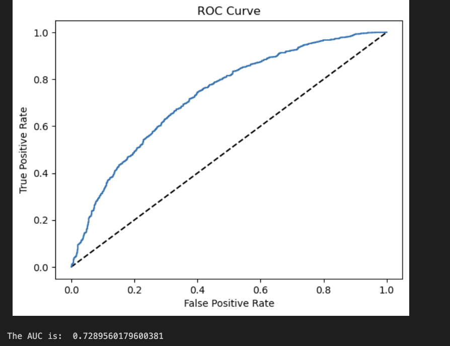

# 41: Logistic Regression

# Table of contents

1. [Logistic Regression](#logistic-regression)
2. [Gradient descent](#gradient-descent)
3. [L1 tai L2 regularization](#l1-tai-l2-regularization)
4. [Stochastic Gradient Descent](#stochastic-gradient-descent)
5. [Mini-Batch Gradient Descent](#mini-batch-gradient-descent)
6. [Allure Suite 08: Gradient descent](#allure-suite-08-gradient-descent)
7. [Logistic regression with scikit-learn](#logistic-regression-with-scikit-learn)
8. [TODO-list for the week](#todo-list-for-the-week)

# Logistic Regression

Logistic regression can be used in classification tasks, to predict a probability that a given input belongs to a certain class [^Geron]. The logistic regression model is a linear model that uses the logistic function to predict the probability of a binary outcome. The logistic function is defined as:
[^ISLP]
$$
\sigma(t) = \frac{1}{1 + \exp(-t)}
$$
Where:

- $\sigma(t)$ is the logistic function
- $t$ is the linear combination of the features and the model parameters

Besides it's usage in binary classification, this function is neural networks and is used in the output layer of the network to predict the probability of the input belonging to a certain class [^SOURANDER].

# Gradient descent

Gradient Descent is an optimization algorithm used to minimize a cost function (MSE fro example) by iteratively adjusting parameters towards the minimum which is done calculating the local gradient of the cost function with respect to the parameters in vector $\theta$ and updating $\theta$ in the direction of the steepest descent[^Geron].

Learning step is the size of the step taken in the direction of the gradient as seen in the picture down. The learning rate is a hyperparameter that controls the size of the step. A small learning rate can slow down convergence (taking many small steps), while a large rate may overshoot the minimum, causing divergence. The learning rate is a critical hyperparameter that must be tuned to ensure the algorithm converges efficiently[^Geron]. Convergence means that the algorithm has reached the minimum of the cost function (most of the time zero) while divergence means that the algorithm has not reached the minimum and is moving away from it.


Image from [^Geron]

## Challenges in Gradient Descent

The cost function can vary in complexity, leading to challenges in finding the global minimum efficiently and avoiding finding the local minimum[^Geron]. Also if the parameter space is large, the algorithm can be slow to converge. This can be mitigated by using Stochastic Gradient Descent or Mini-Batch Gradient Descent.

# L1 tai L2 regularization

Regularization is the process of adding a penalty term to the cost function to prevent overfitting. L1 regularization (Lasso) adds the absolute values of the weights to the cost function, leading to sparse models by setting some weights to zero[^Geron]. L2 regularization (Ridge) adds the squared values of the weights, reducing the magnitude of all weights but keeping them non-zero[^Geron]. Both techniques help reduce model complexity and improve generalization.

# Stochastic Gradient Descent

Stochastic Gradient Descent (SGD) is a variant of the Gradient Descent optimization algorithm that addresses some of the inefficiencies of Batch Gradient Descent, particularly for large datasets. It uses one randomly chosen instance from the training set at each step to compute the gradients[^Geron]. This makes the algorithm significantly faster.

# Mini-Batch Gradient Descent

Mini Batch Gradient Descent is a compromise between Batch Gradient Descent and Stochastic Gradient Descent. It uses a small random set of instances from the training set to compute the gradients[^Geron]. This makes the algorithm faster than Batch Gradient Descent and more stable than Stochastic Gradient Descent.

# Allure Suite 08: Gradient descent

```python
    def training_step(self, i):
        gradient = self.gradient()
        step = self.learning_rate * Vector(*gradient)
        # IMPLEMENT 
        self.w -= step
        self.history.steps.append(TrainingStep(i=i, loss=self.loss(self.X, self.w)))

```

Here on the Gradient descent suite I have implemented the training step function. The function calculates the gradient of the loss function, multiplies it with the learning rate and subtracts it from the weights. The training step is then appended to the history of the training steps.
In gradient loss the weights are updated in the opposite direction of the gradient to minimize the loss function.

# Logistic regression with scikit-learn

Task was to train model using [Digital skills among youth: A dataset from a three-wave longitudinal survey in six European countries](https://www.sciencedirect.com/science/article/pii/S2352340924003652) data

Had very limited time to do this so just used the code provided for preprocessing and then trained the model with the default parameters. Which resulted in the 75 % accuracy.


More values predicted to be 1 were actually 0. This could be since there is different amount of values in the target variable.

```python
    data['RISK101'].value_counts()
    RISK101
    1.0    8980
    0.0    3433
```



# TODO-list for the week

- [x] Watch the videos for logistic regression.
- [x] Read about logistic regression.
- [x] Notebook for logistic regression.
- [x] Allure 08
- [x] Logistic regression with scikit-learn
- [x] Write the learning diary entry for the week
- [x] Polish the learning diary entry for the week

[^SOURANDER]:[Sourander J. (2024). Koneoppimisen Perusteet kurssin materiaali -- Logistinen regressio](https://sourander.github.io/ml-perusteet/algoritmit/linear/logistic)
[^Geron]: Géron A. (2019). Hands-On Machine Learning with Scikit-Learn, Keras, and TensorFlow : Concepts, Tools, and Techniques to Build Intelligent Systems: Vol. Second edition. O’Reilly Media.
[^ISLP]: [James, G., Witten, D., Hastie, T., Tibshirani, R., & Taylor, J. (2023). Introduction to statistical learning with Python. In Springer Texts in Statistics. Springer International Publishing.](https://doi.org/10.1007/978-3-031-38747-0_1)
